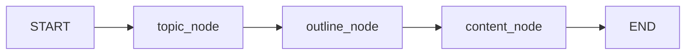

# 04_langgraph_basic.py

## 功能说明

从零构建一个 **LangGraph 有状态图**，理解 State / Node / Edge 三大核心概念。

## 核心组件

| 组件 | 类比 | 说明 |
|------|------|------|
| **State** | 全局变量容器 | `TypedDict` 定义的数据结构，在节点间传递和累积 |
| **Node** | 函数/处理单元 | 接收 State → 返回部分 State 更新 |
| **Edge** | 连接/箭头 | 决定节点间的执行流向 |

## 图结构（本例）



对应代码：
```python
graph.add_edge(START, "topic_node")
graph.add_edge("topic_node", "outline_node")
graph.add_edge("outline_node", "content_node")
graph.add_edge("content_node", END)
```

## 关键 API

```python
from langgraph.graph import StateGraph, START, END

# 1. 定义状态（TypedDict）
class MyState(TypedDict):
    field1: str
    field2: list

# 2. 构建图
graph = StateGraph(MyState)
graph.add_node("node_name", func)         # 注册节点
graph.add_edge("a", "b")                   # 普通边 a→b
graph.add_conditional_edges(...)           # 条件边（05中讲）
app = graph.compile()                       # 编译为可运行应用

# 3. 运行
result = app.invoke(initial_state)
```

## State 更新机制

每个节点函数返回的字典会 **合并（merge）** 到全局 State 中：

```
初始 State: { topic:"", outline:"", content:"", messages:[] }
    ↓ node_topic
State:      { topic:"LangChain", outline:"", content:"", messages:["[选题]..."] }
    ↓ node_outline
State:      { topic:"LangChain", outline:"#...", content:"", messages:[..., "[大纲]..."] }
    ↓ node_content
State:      { topic:"LangChain", outline:#...", content:"...", messages:[..., "[正文]..."] }
```

> 注意：`Annotated[list, operator.add]` 使列表字段变为 **追加模式**，而非替换。

## 运行方式

```bash
python 阶段4/04_langgraph_basic.py
```
