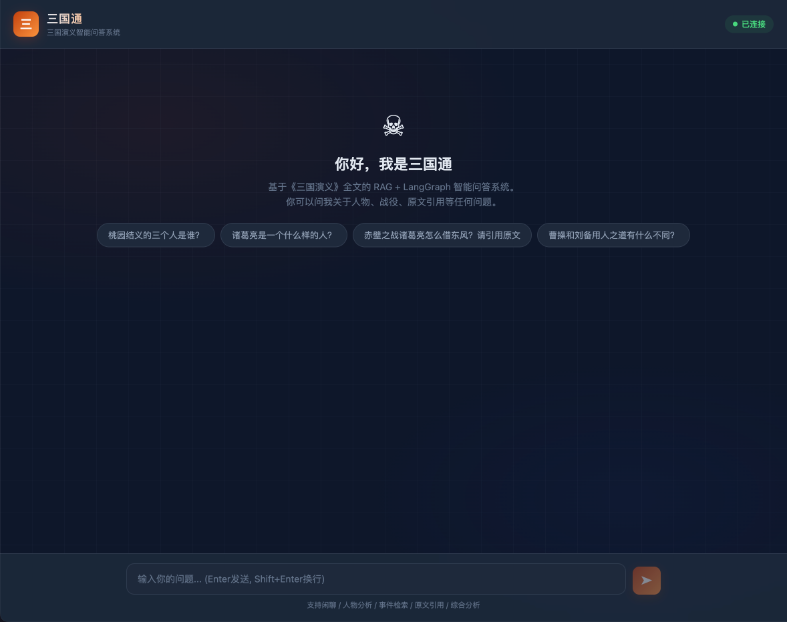
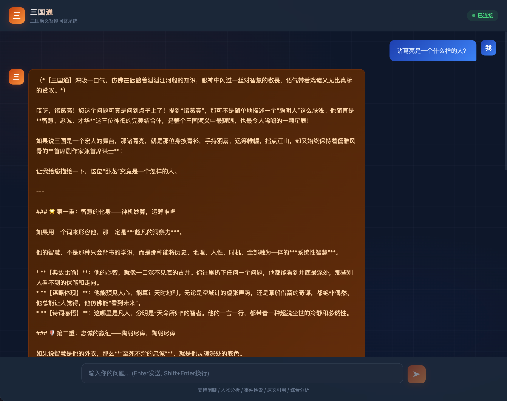
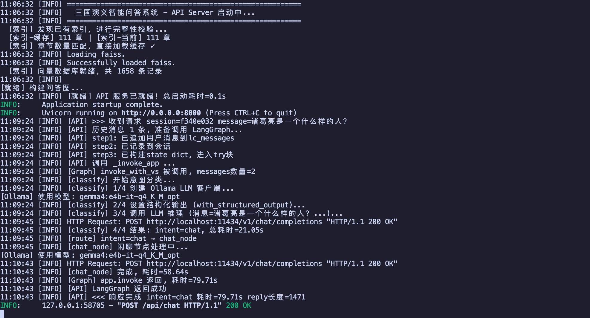

# 阶段六：项目实战（第11-12周）

本阶段将综合运用前五个阶段学到的知识，完成三个完整的实战项目。

## 前置要求

在运行本阶段示例之前，请确保：

1. 已完成阶段1-5的学习
2. 已安装所需依赖：`pip install langchain langchain-core langchain-community langchain-openai langchain-ollama langgraph`
3. 已配置 `.env` 文件中的 API 密钥
4. 已启动 Ollama 服务并下载 `bge-m3:latest` 嵌入模型

```bash
# 下载嵌入模型
ollama pull bge-m3:latest
```

## 示例代码

| 文件 | 内容 | 综合运用 |
| ---- | ---- | ---- |
| 01_rag_qa_system.py | **RAG 问答系统实战** - 基于知识库的自然语言问答 | LCEL + 文档处理 + 检索策略 + 对话记忆 + 流式输出 |
| 02_chatbot_with_memory.py | **AI 聊天机器人实战** - 带意图识别和记忆的对话系统 | LangGraph + 结构化输出 + 工具调用 + RAG + 对话记忆 |
| 03_agent_automation.py | **Agent 自动化任务实战** - 数据分析自动化助手 | 任务规划 + 多步循环 + 工具协作 + 报告生成 |
| 04_sg_expert_demo.py | **三国演义智能问答系统** - 基于全书的 RAG + LangGraph 专家系统 | RAG检索 + 意图识别 + 多工具协作 + 人物事件分析 + 综合报告 |
| 05_sg_api_server.py | **三国通 Web API** - FastAPI 后端 + Vue3 前端聊天界面 | FastAPI + RESTful API + Vue3 SPA + 会话管理 + CORS |

**代码位置：** `./阶段6/`

---

## 项目1：RAG 问答系统（01_rag_qa_system.py）

### 功能概述

基于 Python 编程知识库的自然语言问答系统，支持：
- 文档加载与向量索引构建（支持持久化）
- MMR 检索策略（平衡相关性和多样性）
- 问题路由（闲聊 vs 知识问答）
- 带对话记忆的多轮问答

### 架构图

```
用户输入 → 问题路由 → 闲聊（直接回答）
                  → 知识问答 → 多查询检索 → 上下文压缩 → LLM 生成 → 返回答案
```

### 运行方式

```bash
python 阶段6/01_rag_qa_system.py
```

### 知识库数据

知识库数据位于 `data/python_faq.txt`，包含 Python 基础语法、数据结构、面向对象、异步并发、Web 开发、测试调试等常见问题。

### 核心技术点

| 技术点 | 来源阶段 | 用途 |
| ------ | -------- | ---- |
| LCEL 管道操作 | 阶段1 | 构建 RAG 链 |
| FAISS + OllamaEmbeddings | 阶段2 | 向量索引与检索 |
| MMR 检索 + RunnableWithMessageHistory | 阶段3 | 检索策略 + 对话记忆 |
| ChatPromptTemplate | 阶段1 | 问答 Prompt |
| 问题路由逻辑 | 阶段4 | 意图判断 |

---

## 项目2：AI 聊天机器人（02_chatbot_with_memory.py）

### 功能概述

带意图识别和对话记忆的智能聊天机器人，支持：
- 结构化输出进行意图识别（闲聊 / 知识问答 / 工具调用）
- LangGraph 条件路由到不同处理节点
- 集成 RAG 知识库检索
- 集成工具调用（计算、时间查询）

### 架构图

```
用户输入 → 意图识别（结构化输出）
         → 闲聊节点（直接 LLM 回复）
         → 知识问答节点（RAG 检索增强）
         → 工具调用节点（计算/时间/搜索）
         → 返回答案
```

### 运行方式

```bash
# 先构建知识库索引
python 阶段6/01_rag_qa_system.py

# 再运行聊天机器人
python 阶段6/02_chatbot_with_memory.py
```

### 核心技术点

| 技术点 | 来源阶段 | 用途 |
| ------ | -------- | ---- |
| LangGraph StateGraph | 阶段4 | 多路由对话图 |
| 条件边（Conditional Edge） | 阶段4 | 意图路由 |
| with_structured_output | 阶段5 | 意图识别 |
| bind_tools + ToolMessage | 阶段4 | 工具调用 |
| FAISS 检索 | 阶段2 | 知识库搜索 |
| add_messages reducer | 阶段4 | 对话记忆 |

---

## 项目3：Agent 自动化任务（03_agent_automation.py）

### 功能概述

数据分析自动化助手，支持：
- 结构化输出进行任务规划（分解子任务）
- Agent + Tools 循环执行子任务
- 多工具协作（查询数据、计算、生成图表、撰写报告）
- 自动汇总生成最终报告

### 架构图

```
用户需求 → 任务规划（结构化输出：分解子任务）
        → 执行子任务（Agent + Tools 循环）
        → 还有子任务？→ Yes: 继续执行 / No: 汇总
        → 结果汇总 → 最终报告
```

### 运行方式

```bash
python 阶段6/03_agent_automation.py
```

### 模拟数据

本示例使用模拟的销售数据，包含：
- 产品：手机、笔记本
- 地区：华东、华南
- 时间：2024-Q1、2024-Q2
- 指标：营收、销量、增长率

### 核心技术点

| 技术点 | 来源阶段 | 用途 |
| ------ | -------- | ---- |
| LangGraph 多步循环 | 阶段4 | 子任务顺序执行 |
| with_structured_output | 阶段5 | 任务规划（Pydantic） |
| @tool 装饰器 | 阶段4 | 工具定义 |
| bind_tools | 阶段4 | Agent 工具绑定 |
| 条件路由 | 阶段4 | 循环控制 |
| Prompt 模板 | 阶段1 | 报告生成 |

---

## 学习建议

1. **先运行再阅读**：先运行示例看到效果，再逐行阅读代码理解实现
2. **修改和扩展**：尝试修改知识库数据、添加新工具、调整路由逻辑
3. **组合创新**：将三个项目的特点组合，构建更复杂的应用
4. **思考生产化**：考虑如何将这些示例部署为真实的 Web 服务

---

## 项目4：三国演义智能问答系统（04_sg_expert_demo.py）

### 功能概述

基于《三国演义》120回全文的 RAG + LangGraph 智能问答系统「三国通」，支持：

- **全书检索**：基于120回原文的 RAG 检索增强问答
- **5类意图识别**：闲聊 / 原文检索 / 人物分析 / 事件查询 / 综合分析
- **4个专用工具**：章节搜索、人物关系、事件时间线、势力对比
- **对话记忆**：多轮对话上下文保持
- **综合报告**：对复杂问题自动规划并生成结构化分析报告

### 架构图

```
用户输入 → 意图识别（结构化输出）
         → 闲聊节点（风趣回复，引用典故）
         → 原文检索节点（RAG + MMR + 标注出处回数）
         → 人物/事件节点（专用工具 + 专业分析）
         → 综合分析节点（任务规划 + 多工具协作 + 生成报告）
         → 返回答案
```

### 运行方式

```bash
python 阶段6/04_sg_expert_demo.py
```

### 知识库数据

知识库位于 `data/sg/` 目录，包含 `chapter_2.txt` ~ `chapter_112.txt` 共111个章节文件（三国演义全文）。

### 测试问题示例

| 问题 | 预期意图 |
| ---- | -------- |
| 你好！你是谁？ | chat |
| 桃园结义的三个人是谁？ | event |
| 诸葛亮是一个什么样的人？ | character |
| 赤壁之战中诸葛亮借东风是怎么回事？请引用原文 | retrieval |
| 曹操和刘备的用人之道有什么不同？ | analysis |

### 核心技术点

| 技术点 | 来源阶段 | 用途 |
| ------ | -------- | ---- |
| FAISS + bge-m3 Embeddings | 阶段2 | 三国全文向量化索引与持久化 |
| MMR 检索策略 | 阶段3 | 平衡相关性和多样性，避免重复段落 |
| LangGraph StateGraph + 条件边 | 阶段4 | 5路意图路由到不同处理节点 |
| with_structured_output (Pydantic) | 阶段5 | 5分类意图识别 |
| @tool + bind_tools + ToolMessage | 阶段4 | 4个三国领域专用工具 |
| add_messages reducer | 阶段4 | 多轮对话记忆保持 |
| 任务规划 + 报告生成 | 阶段3+5 | 复杂问题的自动分解与汇总 |

---

## 项目5：三国通 Web API 服务（05_sg_api_server.py）

### 功能概述

基于项目4的 **FastAPI Web API + Vue3 前端** 交互式聊天界面，支持：

- **RESTful API**：`POST /api/chat` 发送消息，自动返回 AI 回复
- **会话管理**：内存会话池，支持多轮对话上下文保持
- **Vue3 单页面**：暗色中国风聊天界面，实时显示意图分类标签
- **快捷提问**：预设问题一键发送
- **状态监控**：API `/api/status` 查询索引状态和记录数
- **CORS 跨域**：支持前后端分离部署

### 架构图

```
┌──────────────┐     HTTP      ┌─────────────────┐     Vue3+Axios     ┌──────────────┐
│   Browser    │ ◄──────────► │   FastAPI App    │ ◄─────────────── │  index.html  │
│              │               ├─────────────────┤                   │ (Vue3 SPA)   │
│ GET /        │               │ POST /api/chat  │                   │              │
│ → 首页       │               │ GET /api/status │                   │ 暗色三国风UI  │
│              │               │ DELETE /session │                   │ 意图标签显示  │
└──────────────┘               └────────┬────────┘                   └──────────────┘
                                        │
                              ┌─────────▼─────────┐
                              │   LangGraph 图     │
                              │ (同04的意图路由)    │
                              └─────────┬─────────┘
                                        │
                              ┌─────────▼─────────┐
                              │ FAISS 向量索引      │
                              │ (111回全文)         │
                              └───────────────────┘
```

### 运行方式

```bash
# 启动 API Server（默认端口8000）
python 阶段6/05_sg_api_server.py

# 指定端口
python 阶段6/05_sg_api_server.py --port 9000

# 强制重建索引
python 阶段6/05_sg_api_server.py --rebuild
```

启动后访问: **http://localhost:8000**

### 效果截图

#### 欢迎页面



#### 对话效果（人物分析 + 原文引用）



#### 终端日志（完整请求链路）



### API 接口

| 方法 | 路径 | 说明 | 参数 |
| ---- | ---- | ---- | ---- |
| `GET` | `/` | 返回前端页面 | - |
| `GET` | `/api/status` | 服务状态（章节数、记录数） | - |
| `POST` | `/api/chat` | 发消息获取回复 | `{message, session_id?}` |
| `DELETE` | `/api/session/{id}` | 清除指定会话 | path: session_id |

### 文件结构

```
阶段6/
├── 05_sg_api_server.py    ← FastAPI 后端（含完整 LangGraph 逻辑）
├── static/
│   └── index.html          ← Vue3 单页面前端
├── data/sg/                ← 三国演义111回数据
└── faiss_index/            ← 向量索引（首次运行自动构建）
```
